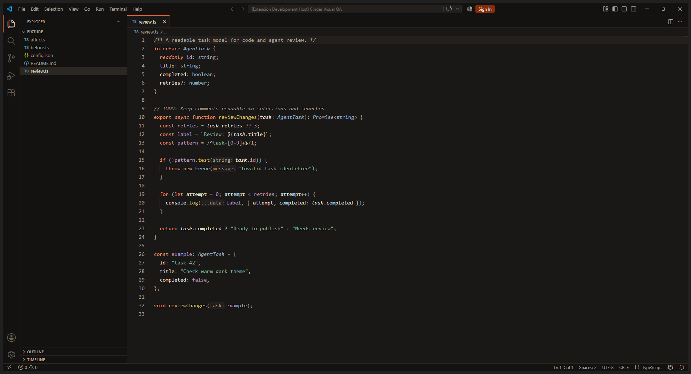
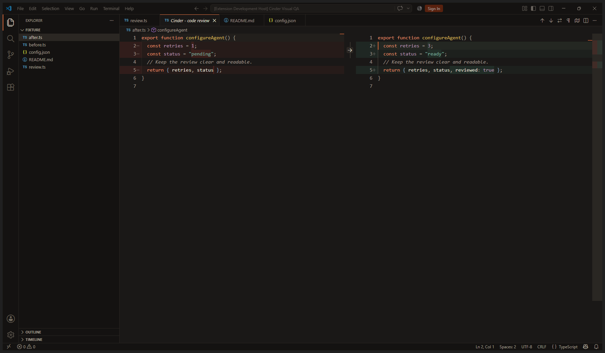

# Cinder

A warm dark theme with charcoal backgrounds, antique gold functions, coral
keywords, copper-green strings and soft steel-blue types.

## Designed for reading

- Warm off-white variables and body text.
- Readable comments, punctuation, hints and inline suggestions.
- Explicit search text colors and visible keyboard focus.
- Restrained Ember accents and tested primary-button hover contrast.
- Coordinated ANSI colors with distinct green and blue-shifted cyan.

## Chat and agents

Colors cover VS Code chat, inline chat, agent sessions, working status, edited
files, next-edit suggestions, Tab-to-accept indicators, review markers and
multi-file diffs. Requests use quiet neutral surfaces; focus stays Ember.

## Screenshots

Actual VS Code desktop captures using Cinder and sample code:





## Install

Install the extension and choose **Cinder** in **Preferences: Color Theme**.
For local packages, use **Extensions: Install from VSIX...**.

VS Code is the primary target. Cursor's Editor Window inherits VS Code themes;
its separate Agents Window and private UI may not honor these colors. Available
agent styling depends on the host version and capabilities.

## Contrast

Automated checks cover syntax on defined editor, selection and review backgrounds,
plus selected interface states. Comments reach 6.68:1 on the editor and 5.05:1 on
a selection over the current line. This is not a claim that every extension,
terminal program or overlay combination meets WCAG. Comfort also depends on font,
display, environment and individual preference. TODO highlighting requires a
language grammar that exposes task scopes.

### Inline suggestion readability

VS Code 1.138 applies 70% opacity to syntax-highlighted inline suggestions.
This can make them dimmer than the theme's configured ghost-text color. To use
the theme's readable single-color suggestion text, optionally set:

```json
"editor.inlineSuggest.syntaxHighlightingEnabled": false
```

The extension does not change this preference automatically. Visual review
covered the native editor, selections, search, hover, terminal, diffs and the
initial agent panel. Active AI conversations and tool approvals were not tested.

[Source and design specification](https://github.com/Muowl/cinder)
